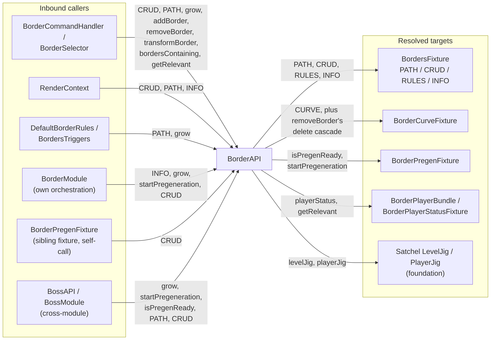
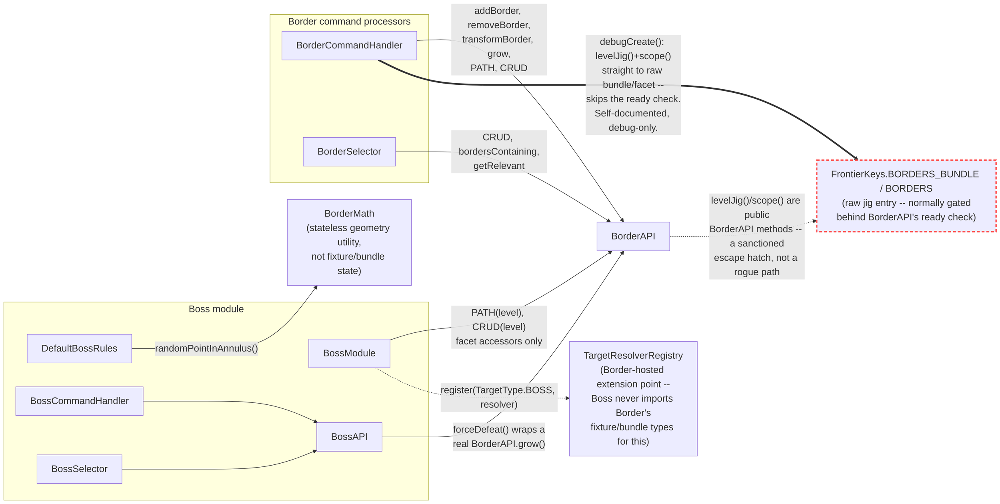

# BorderAPI — high-level IO (scratch)

Not promoted to wiki yet. Inbound callers on the left, what `BorderAPI` itself resolves to on the
right. Every edge below was traced by hand from real code -- a plain grep for `BorderAPI\.` turns
up a lot of noise in this codebase (javadoc/comment mentions of the removed `BorderAPI.borders()`
method, and preconditions like "only called once `isPregenReady()` has passed" documented in
places that don't actually call it) -- those are excluded.

Derived from: `border/BorderAPI.java`, `border/server/commands/{BorderCommandHandler,BorderSelector}.java`,
`border/client/render/level/RenderContext.java`, `border/server/rules/{DefaultBorderRules,BordersTriggers}.java`,
`border/BorderModule.java`, `border/common/fixture/BorderPregenFixture.java`,
`boss/BossAPI.java`, `boss/BossModule.java`.

Two things worth flagging while tracing this:
- `BorderCommands.java` (the command *registration* class) never calls `BorderAPI` directly --
  only `BorderCommandHandler` and `BorderSelector` do. `BorderCommands` just wires literal/argument
  nodes to handler methods.
- `BorderPregenFixture` (a sibling fixture living *inside* `BordersBundle`, alongside
  `BordersFixture` itself) reaches back out through `BorderAPI.CRUD()` rather than through any
  direct sibling-to-sibling bundle access -- a fixture calling back into its own module's public
  facade from inside the bundle it lives in.

---

## Does anything bypass BorderAPI? (Boss module + command processors)

Same question, run against the Boss module and both modules' command processors: does anything
reach around `BorderAPI` into Border's fixture/bundle internals directly, legally or not?

Derived from: `boss/BossModule.java`, `boss/BossAPI.java`, `boss/server/rules/DefaultBossRules.java`,
`boss/server/commands/{BossCommandHandler,BossCommands,BossSelector}.java`,
`border/server/commands/{BorderCommandHandler,BorderCommands,BorderSelector}.java`,
`border/common/navigator/{TargetResolverRegistry,TargetType}.java`, `border/common/BorderMath.java`.

**Boss module: clean.** Every real touch point resolves through `BorderAPI`'s own facet
accessors (`PATH(level)`, `CRUD(level)`) or a proper Border-hosted extension point
(`TargetResolverRegistry` -- Boss registers a resolver for `TargetType.BOSS` without ever
importing Border's fixture or bundle types, matching Satchel's own `MobInterestRegistry` shape
per `discovery-systems.md`). `BorderMath` is a stateless geometry helper, not fixture/bundle
state, so using it directly isn't a facade question. `BossModule`'s own inline comment
(FRO_047) confirms this was a deliberate migration *away* from a raw `BordersFixture`
reference to these facet accessors.

**Command processors: one bypass, and it's a legal one.** `BorderCommandHandler.debugCreate()`
reaches straight past the facet-resolver "ready" gate to the raw
`FrontierKeys.BORDERS_BUNDLE`/`BORDERS` jig entry -- but it does so through `BorderAPI.levelJig()`
and `BorderAPI.scope(level)`, which are themselves public `BorderAPI` methods. So it's not a rogue
path around the facade; it's a sanctioned escape hatch the facade exposes on its own surface. The
method's own doc comment explains why: the normal gated accessors collapse "bundle exists but
Borders facet ABSENT" and "not ready yet" into one `Optional.empty()`, and this debug command
needs to tell those two apart. Narrowly scoped (one debug command, not reused anywhere else).
Everything else in `BorderCommandHandler`/`BorderSelector` goes through the same ordinary
`BorderAPI` surface as the IO diagram above. `BorderCommands.java`/`BossCommands.java`
(registration only) call neither facade at all, same finding as the caller diagram above.
`BossCommandHandler`/`BossSelector` call only `BossAPI` -- zero direct `BorderAPI` calls, real or
otherwise.

