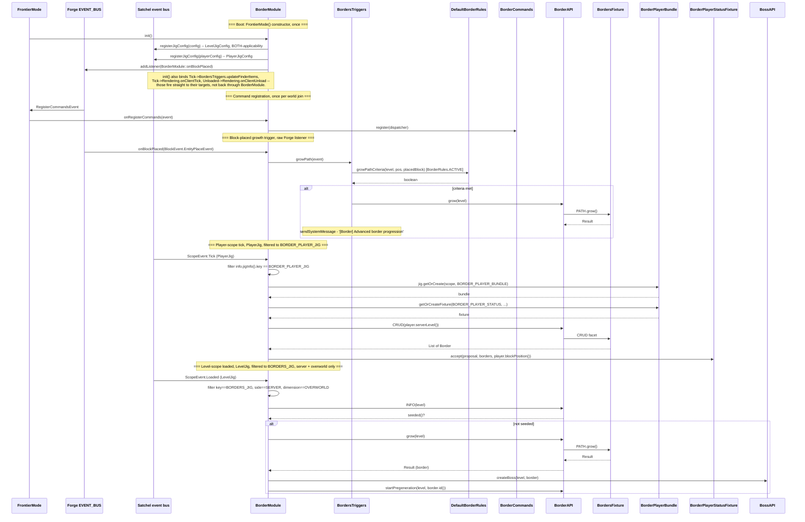

# BorderModule — signal flow (scratch)

Not promoted to wiki yet. Every distinct entry point that actually runs code inside
`BorderModule` as of current source, stacked as separate sections in one diagram (they trigger
independently, not sequentially in real time -- the vertical order below is just reading order,
not a real timeline).

Derived from: `border/BorderModule.java`, `FrontierMode.java`, `border/server/rules/BordersTriggers.java`,
`border/BorderAPI.java`.

One thing worth flagging: `init()` also wires `Tick -> BordersTriggers.updateFinderItems`,
`Tick -> Rendering.onClientTick`, and `Unloaded -> Rendering.onClientUnload` directly to
Satchel's event bus via the `EventHandlers` builder. Those are real signals BorderModule sets up,
but the dispatch calls the target method straight -- BorderModule itself is off the stack by the
time they actually fire. Shown as a note, not a flow, for that reason.

