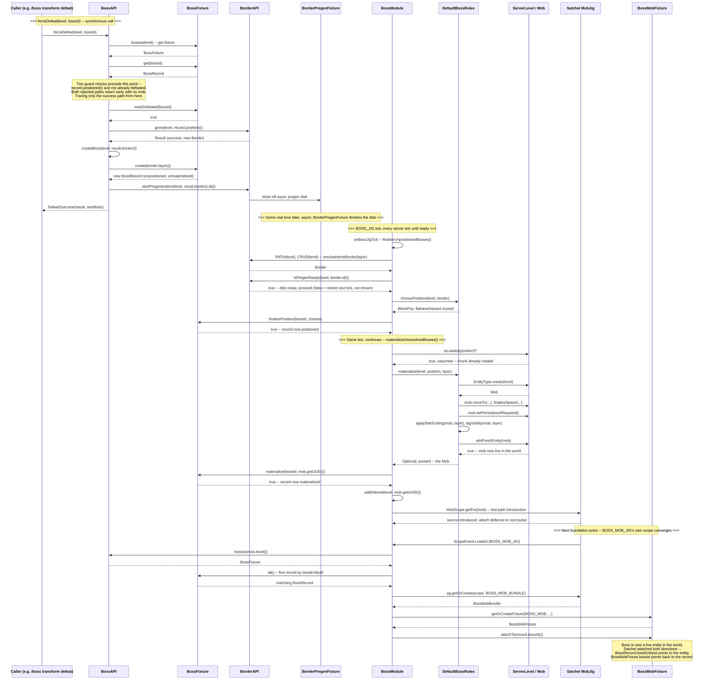

# forceDefeat() -> boss instanced as a mob (scratch)

Not promoted to wiki yet. Traces the full path from `BossAPI.forceDefeat(level, bossId)` being
called through to the next boss standing in the world as a real, Satchel-attached `Mob` entity --
assuming its home chunk is already loaded by the time materialization is attempted. Chunk-loaded
being assumed removes the tick-retry loop in `materializeUnresolvedBosses` (normally it just waits
for `Level.isLoaded` to go true), but it does **not** remove the separate pregeneration gate --
`finalizeUnpositionedBosses` still can't pick a real position until `BorderAPI.isPregenReady()`
passes for the new border's disk, which is genuine async wait time (can be real minutes), shown
here as a Note rather than a modeled retry loop.

Two early-exit guards inside `forceDefeat` itself aren't traced further (both return with no mob):
the target record must already be `positioned()` (a still-pregenerating boss can't be force-
defeated), and it must not already be defeated (FRO_058's double-defeat guard). Only the success
path is shown.

The diagram spans three genuinely separate execution contexts, which is what makes this one worth
having as its own drawing rather than folding into an existing one:

1. **The synchronous `forceDefeat` call itself** -- ends the instant it returns a `DefeatOutcome`,
   well before any mob exists.
2. **`BOSS_JIG`'s own tick** (`BossModule.onBossJigTick`, every server tick) -- this is where
   `finalizeUnpositionedBosses()` (once pregen is ready) and `materializeUnresolvedBosses()` (once
   the chunk is loaded) actually run, in that order, same tick.
3. **The next foundation pulse**, on an entirely different scope (`BOSS_MOB_JIG`, `MobScope`, not
   `BOSS_JIG`'s `LevelScope`) -- `BossModule.onBossMobScopeLoaded` is what actually attaches
   `BossMobFixture` to the freshly materialized entity. The mob is genuinely alive in the world one
   full step before this reverse-pointer exists.

Derived from: `boss/BossAPI.java`, `boss/BossModule.java` (`onBossJigTick`,
`finalizeUnpositionedBosses`, `materializeUnresolvedBosses`, `registerBossMobJig`,
`onBossMobScopeLoaded`), `boss/common/fixture/{BossFixture,BossRecord,BossMobFixture}.java`,
`boss/server/rules/{BossRules,DefaultBossRules}.java` (`materialize`'s actual `EntityType.create`
/ `addFreshEntity` spawn sequence).

