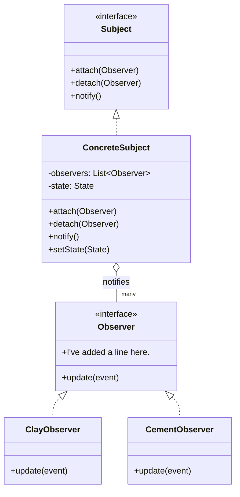

# Observer Pattern — test drawing

Scratch file, not wiki content. Testing the draw.io Mermaid import (Arrange > Insert > Mermaid)
and a manual round-trip back to Mermaid source after editing shape labels directly in draw.io.

Round-tripped by hand from `Scrapyard/draw.io/test observer file..drawio` after these edits made
in the draw.io canvas (not reflected in the file's own cached mermaidData, since draw.io doesn't
push shape-label edits back into that):
- `ConcreteObserverA` relabeled to `ClayObserver`
- `ConcreteObserverB` relabeled to `CementObserver`
- `Observer.update(event)` got a second line: "I've added a line here."

