# SatchelHealth tracker inertness — activation gap (scratch)

Not promoted to wiki yet. Sketched for the SAT_049 investigation (Angela/Dev Satchel) — the
`internalTicks` stuck at 0 while `externalTicks` climbs normally (2708 on unload, in the ticket's
own repro), for `TrackerFixture` under all three of `SatchelHealth`'s jigs (`MOB_JIG`, `LEVEL_JIG`,
`PLAYER_JIG`), and for FrontierMode's `BorderPregenFixture` on the same shared engine path.

Two things are happening at once, and this diagram tries to show both: (1) the tick path that
makes the bug look alive from the logs (`ScopeEvent.Tick` → `countExternalTick()`, no lifecycle
gate), running in parallel with (2) the activation path that's actually wedged
(`ScopeEngine_Server.hydrateBundle()` skipping `hydrateFrom(...)` entirely when persistence isn't
a declared capability, so the bundle never leaves `CREATED` and `onJigTick()` never fires). The
diagnostic that should have caught (2) — `SatchelBundle.healthCheckPulse()`, RM_SAT_013's
stuck-below-`ACTIVE` warning — turns out to be dead for the same underlying reason
(`participatesInExecutionPulse` also defaults false and `SatchelHealth` never overrides it), shown
as the third block.

The highlighted red block is the specific spot Angela's proposed engine fix targets: change
`ScopeEngine_Server.hydrateBundle()` so "persistence not required" hydrates from an empty/no-op
source (same as the real-persistence branch already does when no saved data exists yet) instead of
skipping hydration outright. The alternative, narrower fix — have `SatchelHealth` just declare
`.capabilities(...).persistence(true)` on its three `registerXHealthCheck()` calls — is a config
change at the call sites shown in the top note, not a change to the engine itself, so it isn't what
the highlight marks.

Derived from: `Satchel/src/main/java/com/arryn/satchel/server/jig/guts/ScopeEngine_Server.java`
(`hydrateBundle`, `resolveServerLevel`, `onJigTick`, `onExecutionPulse`),
`Satchel/src/main/java/com/arryn/satchel/common/bundle/SatchelBundle.java` (`hydrateFrom`,
`onLoaded`, `healthCheckPulse`, `isHydrated`), `Satchel/src/main/java/com/arryn/satchel/common/tracking/SatchelHealth.java`
(`registerMobHealthCheck`/`registerLevelHealthCheck`/`registerPlayerHealthCheck` — none call
`.capabilities(...)` or `.withExecutionPulse(true)`), `Satchel/src/main/java/com/arryn/satchel/common/newconfig/newnew/JigPolicies.java`
(`Lifecycle.defaults()`, `Capabilities.defaults()` — both default the relevant flag false), and
`Satchel/src/main/java/com/arryn/satchel/common/newconfig/TrackerFixture.java` (`onJigTick`
increments `internalTicks`; `countExternalTick` is separate and ungated). Cross-checked against
`backhaul/wiki/satchel/architecture/runtime.md`'s own dispatch-chain and `participatesInExecutionPulse`
sections and `persistence.md`'s hydration-lifecycle rules — both hold up; this is a real gap the
docs don't yet describe, not a docs/code mismatch.

```mermaid
%%{init: {'themeVariables': {'fontSize': '40px'}, 'sequence': {'actorFontSize': 28, 'actorFontWeight': 'bold', 'messageFontSize': 24, 'noteFontSize': 24}}}%%
sequenceDiagram
    autonumber
    participant Forge as Forge Tick/Level Events
    participant Dispatch as FoundationLifecycleDispatcher
    participant Jig as ASatchelJig (LevelJig/MobJig/PlayerJig)
    participant Bus as SatchelEventBus
    participant Health as SatchelHealth (EventHandlers)
    participant Engine as ScopeEngine_Server
    participant Bundle as SatchelBundle
    participant Tracker as TrackerFixture

    Note over Health: registerXHealthCheck() at boot:<br/>lifecycle(JigPolicies.Lifecycle.defaults().withTick(true))<br/>no .capabilities(...) call -> requiresPersistence = false<br/>no .withExecutionPulse(true) -> participatesInExecutionPulse = false

    rect rgb(30,42,58)
    Note over Jig,Bundle: Scope load (once per dimension/mob/player scope)
    Forge->>Dispatch: LevelEvent.Load / poll resolves mob / PlayerLoggedIn
    Dispatch->>Jig: handleExecutionPulse -> tryMarkScopeReady -> onLoad
    Jig->>Bus: post(ScopeEvent.Loaded)
    Bus->>Health: onXScopeLoaded(event)
    Health->>Jig: jig.getOrCreate(scope, TRACKER_BUNDLE)
    Jig->>Engine: create(info, key)
    Engine->>Bundle: new SatchelBundle()  [CONSTRUCTED]
    Engine->>Bundle: onCreated()  [CREATED]
    Engine->>Engine: hydrateBundle(info, key, bundle)
    Engine->>Engine: caps = info.policies().capabilities()
    alt caps.requiresPersistence() == true (normal case, e.g. Border)
        Engine-->>Engine: resolveServerLevel returns real ServerLevel
        Engine->>Bundle: hydrateFrom(savedData or empty source)
        Bundle-->>Bundle: CREATED -> HYDRATED, isHydrated()=true
        Engine->>Bundle: onLoaded()
        Bundle-->>Bundle: HYDRATED -> LOADED -> ACTIVE
    else caps.requiresPersistence() == false (SatchelHealth's jigs -- this bug)
        Engine-->>Engine: "capability not required -> skip", returns null
        rect rgb(64,24,24)
        Note over Engine,Bundle: ENGINE FIX TARGET (Angela, SAT_049)<br/>ScopeEngine_Server.hydrateBundle():<br/>level == null short-circuits the whole method --<br/>bundle.hydrateFrom(...) is never called at all,<br/>not even from an empty source.
        Engine--xBundle: hydrateFrom(...) NOT CALLED
        Note over Bundle: isHydrated() stays false forever.<br/>onLoaded() requires isHydrated()==true -> never fires.<br/>Bundle wedged at CREATED. Never reaches LOADED/ACTIVE.
        end
    end
    end

    rect rgb(30,42,58)
    Note over Jig,Tracker: Every tick thereafter -- this is why it LOOKS alive
    Forge->>Dispatch: TickEvent.ServerTickEvent
    Dispatch->>Jig: onTick(scopeInfo)
    Jig->>Bus: post(ScopeEvent.Tick)
    Bus->>Health: onXScopeTick(event)
    Health->>Tracker: countExternalTick()
    Note right of Tracker: Direct fixture call, no lifecycle gate --<br/>externalTicks increments normally.<br/>(SAT_049 repro: externalTicks=2708 on unload)

    Jig->>Engine: coupler().onJigTick(info)
    Engine->>Engine: for each bundle in scope:<br/>skip unless lifeCycleState()==ACTIVE
    Engine--xBundle: bundle.onJigTick() NEVER CALLED (still CREATED)
    Note over Tracker: internalTicks stays 0 forever.<br/>(SAT_049 repro: internalTicks=0 on unload)
    end

    rect rgb(48,32,56)
    Note over Jig,Engine: Also dead: the diagnostic that should have caught this
    Note over Jig: participatesInExecutionPulse() == false (SatchelHealth default, never overridden)
    Jig--xEngine: coupler().onExecutionPulse(info) never invoked (ASatchelJig gates on this flag)
    Note over Engine,Bundle: ScopeEngine_Server.onExecutionPulse()'s per-bundle<br/>bundle.healthCheckPulse() (RM_SAT_013's own "stuck below ACTIVE" warning)<br/>never runs either -- two independent silent failures stacked on each other.
    end
```

