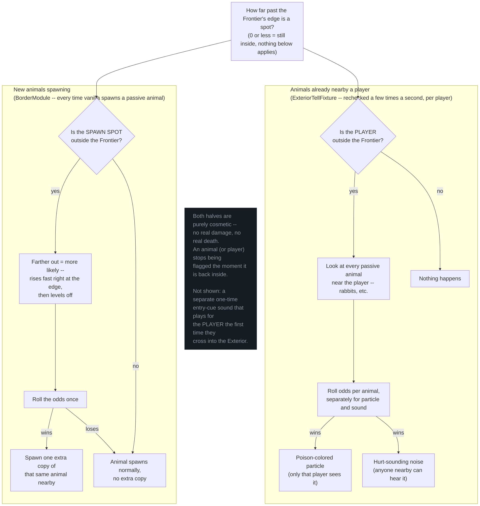

# Sick Wildlife -- ELI5 (scratch)

Not promoted to wiki yet. High-level block diagram for RM_FRO_037 ("Brenda," Frontier Sickness
epoch 1), specifically the **Sick Wildlife** half of [FRO_099](../../backhaul/tickets/FRO_099_frontier-sickness-core-build.md)
(design source: [FRO_098](../../backhaul/tickets/FRO_098_design-note-for-sick-wildlife-passive-mo.md)
and `wiki/frontiermode/design/exterior.md#sensory-design`'s "Sick wildlife" bullet) -- the new
function giving a sound and visual effect to passive animal mobs (rabbits etc.) once a player or
those animals are outside the Frontier.

Two independent halves, both keyed off the same underlying value -- how far past a border's edge
a position is (`BorderAPI.MATH.distanceOutside`, minimum across every border on the level):

1. **`ExteriorTellFixture`** (player-scoped, manually ticked from `BorderModule.onPlayerScopeTick`
   every player tick -- not off Satchel's normal `onJigTick()` dispatch, which SAT_049 found is
   dead in practice). Every ~1 second of game time, if the *player* is outside the Frontier, rolls
   two independent chances per nearby passive animal: a poison-colored particle (targeted, only
   that player sees it) and a hurt-sounding noise (area broadcast). Purely cosmetic -- no real
   damage, no death; a mob "clears" the moment it (or the player) is back inside.
2. **`BorderModule.onMobSpawnFinalize`** (hooked into the mod's shared `MobSpawnEvent.FinalizeSpawn`
   handler, alongside Boss's own delegate). Every time vanilla finalizes a passive-animal spawn, if
   the *spawn position* is outside the Frontier, rolls once against a distance-scaled chance
   (`FrontierSicknessLogic.wildlifeDensityMultiplier` -- rises fast right at the edge, flattens out
   further in, per project-owner direction) to spawn one extra copy of that same animal nearby.

Not shown here (separate, player-only, not an animal-mob effect): the one-time Entry Cue bass-drop
tone that plays for the player the moment they first cross into the Exterior, also driven from the
same `onPlayerScopeTick` handler.

Derived from: `border/common/player/ExteriorTellFixture.java` (full), `border/common/
FrontierSicknessLogic.java` (full, `wildlifeDensityMultiplier`), `border/BorderModule.java`
(`onPlayerScopeTick`, `onFrontierSicknessTick`, `onMobSpawnFinalize`, `spawnDensityCompanion`),
`wiki/frontiermode/design/exterior.md#sensory-design`, `FRO_098`/`FRO_099` ticket bodies (including
FRO_099's build log, which is the source for the "manually ticked, not via onJigTick()" detail and
the SAT_049 cross-reference).

Large-font standalone render: `sick-wildlife-eli5.html`
