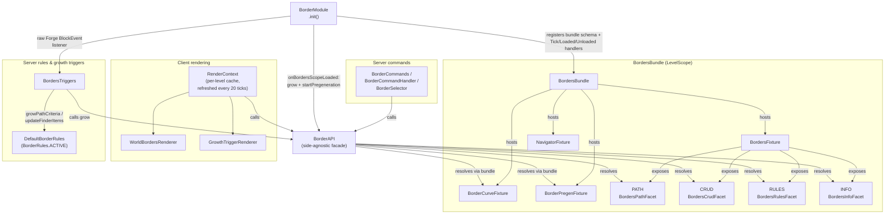

<!-- bh-header:start -->
**mcRepos** — [Dashboard](../../../../BACKHAUL.md) · [Wiki Index](../../../WIKI_INDEX.md) · reference / diagrams
<!-- bh-header:end -->

# Border Module Shape

High-level module map of Border: BordersBundle's sibling fixtures, BordersFixture's four facets, the BorderAPI facade, and the three consumer surfaces (commands, client rendering, server rules/triggers).

Large-font standalone render: [html/border-module-shape.html](html/border-module-shape.html).

Moved here from the old `frontiermode/diagrams` category as part of consolidating every diagram
under [Reference](_diagrams.md) -- see that page for the convention this now follows.

Scoped to the world-scoped (`LevelScope`) half of Border only -- the parallel `PlayerScope`
structure (`BorderPlayerBundle`/`BorderPlayerStatusFixture`) is left for its own diagram. Assumes
the reader already knows Satchel's bundle/fixture/jig model; nothing outside `border/` is shown,
including the one live call this module makes out to Boss on level bootstrap
(`BorderModule.onBordersScopeLoaded` -> `BossAPI.createBoss`).

Derived from: `border/BorderModule.java`, `border/BorderAPI.java`,
`border/common/bundle/BordersBundle.java`, `border/common/fixture/BordersFixture.java`,
`border/server/commands/{BorderCommands,BorderCommandHandler,BorderSelector}.java`,
`border/client/render/level/{RenderContext,WorldBordersRenderer,GrowthTriggerRenderer}.java`,
`border/server/rules/{BordersTriggers,DefaultBorderRules,BorderRules}.java`. Checked against
[Border](../../frontiermode/architecture/border.md) and
[Border Vocabulary](../../frontiermode/architecture/border-vocabulary.md) -- no drift found
between either page and current source.

