<!-- bh-header:start -->
**mcRepos** — [Dashboard](../../../../BACKHAUL.md) · [Wiki Index](../../../WIKI_INDEX.md) · reference / diagrams
<!-- bh-header:end -->

# Bundle Lifecycle

How a `SatchelBundle` moves through its seven `LifecycleState`s, and which layer -- Jig
(`ASatchelJig`), Coupler (`AScopeCoupler`), Engine (`ScopeEngine_Server`), or the Bundle itself --
drives each step. Nodes are labeled by the layer that owns the call; state nodes (circles) are
`SatchelBundle`'s own `LifecycleGuard` states.

Large-font standalone render: [html/bundle-lifecycle.html](html/bundle-lifecycle.html).

Server-side only -- `ScopeEngine_Client`'s bundle creation/activation is parcel-driven
(`applyIncomingParcels`) rather than persistence-driven, and is out of scope for this diagram.
Traces the path from a consumer's first `getOrCreate(scope, key)` call through to `ACTIVE`, plus
the tick and unload paths out of `ACTIVE`. The branch on `requiresPersistence()` is the one real
fork in the chain: when true (every real consumer today -- e.g. Border), the bundle always reaches
`HYDRATED` and then `ACTIVE` in the same call, whether or not saved data actually exists yet, since
`hydrateBundle()` falls back to an explicit empty source when there's nothing to load. When false
(the capability's default, and the value for any jig that never calls `.capabilities(...)`), the
same method returns before ever calling `bundle.hydrateFrom(...)` at all -- so a bundle whose jig
doesn't declare `requiresPersistence(true)` cannot reach `ACTIVE` by this path, regardless of
whether it actually needs persisted state. [Jig & Scope Runtime](../../satchel/architecture/runtime.md)
and [Persistence](../../satchel/architecture/persistence.md) describe the surrounding dispatch
chain and the hydration contract respectively; neither page currently documents this specific
`requiresPersistence()`-gates-`ACTIVE`-reachability shape.

Derived from: `Satchel/src/main/java/com/arryn/satchel/server/jig/guts/ScopeEngine_Server.java`
(`get`, `create`, `hydrateBundle`, `resolveServerLevel`, `onJigTick`, `unload`),
`Satchel/src/main/java/com/arryn/satchel/common/bundle/SatchelBundle.java` (`onCreated`,
`hydrateFrom`, `onLoaded`, `onJigTick`, `onDestroyed`, `isHydrated`),
`Satchel/src/main/java/com/arryn/satchel/common/bundle/LifecycleState.java` (the seven-state enum)
and `LifecycleGuard.java` (transition rules), `Satchel/src/main/java/com/arryn/satchel/common/jig/guts/AScopeCoupler.java`
(`getOrCreate`, `onJigTick`, `onScopeUnload`), and `Satchel/src/main/java/com/arryn/satchel/common/jig/guts/ASatchelJig.java`
(`getOrCreate`/`ask`/`get` delegating straight to `coupler()`).

```mermaid
flowchart TD
    classDef jig fill:#0d4429,stroke:#3fb950,color:#c9d1d9
    classDef coupler fill:#4d2d00,stroke:#d29922,color:#c9d1d9
    classDef engine fill:#3c1e70,stroke:#a371f7,color:#c9d1d9
    classDef bundle fill:#161b22,stroke:#6e7681,color:#c9d1d9
    classDef state fill:#0d2847,stroke:#58a6ff,color:#ffffff,stroke-width:2px

    Start(["Consumer code<br/>e.g. a ScopeEvent.Loaded handler"])
    J1["Jig: getOrCreate(scope, key)<br/>/ ask() / get()"]:::jig
    C1["Coupler: getOrCreate(info, key)<br/>tries get(info, key) first"]:::coupler
    E1["Engine: get(info, key)"]:::engine
    Found{"Bundle already present<br/>for this scope?"}
    Existing(["existing bundle returned"])
    NotFound["Coupler catches<br/>SatchelException.BundleNotFound --<br/>routine on first access, falls through"]:::coupler
    ECreate["Engine: create(info, key)"]:::engine
    NewBundle["Bundle: new SatchelBundle(scope, key)"]:::bundle
    StConstructed(("CONSTRUCTED")):::state
    ApplyFixtures["Engine: applyFixture() per<br/>FixtureDecl in the bundle schema"]:::engine
    OnCreated["Bundle: onCreated()<br/>-- fixture.onCreated() each,<br/>markDirty() if server"]:::bundle
    StCreated(("CREATED")):::state
    HydrateCall["Engine: hydrateBundle(info, key, bundle)"]:::engine
    CapsCheck{"info.policies().capabilities()<br/>.requiresPersistence() ?"}
    ResolveLevel["Engine: resolveServerLevel(PERSISTENCE)<br/>returns the ServerLevel"]:::engine
    HydrateFrom["Bundle: hydrateFrom(source) --<br/>real SavedData if present,<br/>else an explicit empty source"]:::bundle
    StHydrated(("HYDRATED<br/>isHydrated() = true")):::state
    Skip["Engine: returns null --<br/>'capability not required, skip'"]:::engine
    NeverHydrated["Bundle: hydrateFrom(...) is never<br/>called -- stays CREATED,<br/>isHydrated() stays false"]:::bundle
    OnLoadedCall["Bundle: onLoaded()<br/>-- fixture.onLoaded() each"]:::bundle
    StLoaded(("LOADED")):::state
    StActive(("ACTIVE<br/>(same call, no gap)")):::state
    TickLoop["Engine: onJigTick(info) -- per jig tick,<br/>for each bundle, skip unless<br/>lifeCycleState()==ACTIVE"]:::engine
    OnJigTickCall["Bundle: onJigTick()<br/>-- fixture.onJigTick() each"]:::bundle
    UnloadCall["Engine: unload(info) -- on scope unload"]:::engine
    OnDestroyedCall["Bundle: onDestroyed()<br/>-- fixture.onRemoved() each"]:::bundle
    StDestroying(("DESTROYING")):::state
    StDestroyed(("DESTROYED")):::state

    Start --> J1 --> C1 --> E1 --> Found
    Found -- yes --> Existing
    Found -- no --> NotFound --> ECreate --> NewBundle --> StConstructed --> ApplyFixtures --> OnCreated --> StCreated
    StCreated --> HydrateCall --> CapsCheck
    CapsCheck -- "true, e.g. Border" --> ResolveLevel --> HydrateFrom --> StHydrated
    CapsCheck -- "false (default)" --> Skip --> NeverHydrated
    StHydrated --> OnLoadedCall --> StLoaded --> StActive
    StActive --> TickLoop --> OnJigTickCall
    StActive --> UnloadCall --> OnDestroyedCall --> StDestroying --> StDestroyed
```

