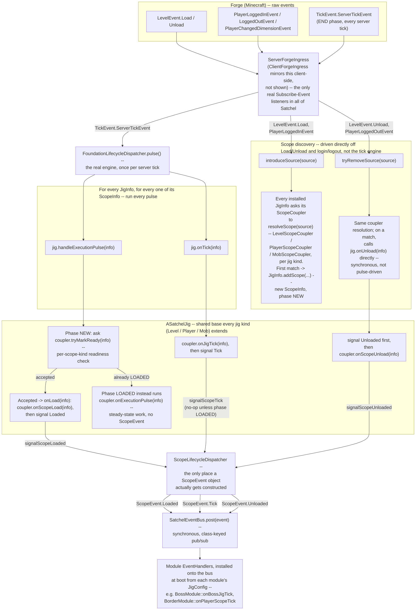

<!-- bh-header:start -->
**mcRepos** — [Dashboard](../../../../BACKHAUL.md) · [Wiki Index](../../../WIKI_INDEX.md) · reference / diagrams
<!-- bh-header:end -->

# Satchel: Forge Event to ScopeEvent

High-level block diagram of the pipeline every real Forge event runs through before a module ever
sees a `ScopeEvent.Loaded`/`Tick`/`Unloaded`. This is Satchel's own plumbing, not any one mod's --
every `EventHandlers.builder().on(ScopeEvent.Tick.class, ...)` registration a module makes (e.g.
`BorderModule`/`BossModule` in FrontierMode) is the very last box in this diagram.

Large-font standalone render: [html/satchel-forge-to-scopeevent.html](html/satchel-forge-to-scopeevent.html).

Two genuinely separate paths run through `ServerForgeIngress`, not one:

- **Scope discovery** (`LevelEvent.Load`/`Unload`, player login/logout) runs synchronously off the
  raw Forge event itself -- `introduceSource`/`tryRemoveSource` ask every installed `JigInfo`'s
  `ScopeCoupler` to resolve the source, right then. This is where a brand-new `ScopeInfo` gets
  created (phase `NEW`), or where an existing one gets torn down directly via `jig.onUnload(info)`
  -- unload does **not** wait for the next tick pulse.
- **Everything else** (`Loaded`, `Tick`) only happens from inside
  `FoundationLifecycleDispatcher.pulse()`, driven once per server tick off
  `TickEvent.ServerTickEvent`. `pulse()` walks every `JigInfo` x `ScopeInfo` pair and calls
  `handleExecutionPulse` (readiness convergence: `NEW` -> ask the coupler `tryMarkReady` -> once
  accepted, `onLoad` -> `ScopeEvent.Loaded`) and `onTick` (`coupler.onJigTick` ->
  `ScopeEvent.Tick`, a no-op unless the scope is already `LOADED`).

`ASatchelJig` is the one base class `LevelJig`/`PlayerJig`/`MobJig` all extend, and it's the only
place that ever calls `ScopeLifecycleDispatcher` -- which is in turn the only place a `ScopeEvent`
object actually gets constructed and posted to `SatchelEventBus`. The bus itself is a plain
synchronous, class-keyed pub/sub with no filtering of its own -- by the time anything reaches it,
every invariant (readiness, phase, scope-kind matching) has already been enforced upstream.

**Deliberately not shown:** every `handleExecutionPulse`/`onTick` call in this diagram also drives
a second, genuinely separate system through the same coupler -- `coupler().onExecutionPulse`/
`onJigTick`/`onScopeUnload` (in `AScopeCoupler`) each delegate straight to a `ScopeEngine`
(`engine().onExecutionPulse`/`onJigTick`/`unload`), which handles bundle-backend mechanics
(persistence hydration/flush server-side, bundle construction only client-side) -- see that
interface's own doc: "how backend operations are executed, not when or why they occur." The Engine
call and the `ScopeEvent` signal are sibling steps off the same jig hook, not a pipeline where one
feeds the other -- on tick the Engine runs first, then the signal; on unload that order flips
(the `ScopeEvent.Unloaded` signal fires *before* `engine().unload()` tears the bundle down, so a
module's unload handler still sees a live bundle). Not expanded into this diagram since it's an
orthogonal concern to "how does a ScopeEvent get made," not a step in that pipeline.

Derived from: `server/lifecycle/ServerForgeIngress.java`, `common/jig/guts/LogicalFoundation.java`
(`introduceSource`/`tryRemoveSource`/`installConfigs`), `common/lifecycle/
FoundationLifecycleDispatcher.java`, `common/jig/guts/ASatchelJig.java`, `common/jig/guts/
AScopeCoupler.java`, `common/jig/guts/ScopeEngine.java`, `common/lifecycle/
ScopeLifecycleDispatcher.java`, `common/lifecycle/SatchelEventBus.java`, `common/newconfig/
EventHandlers.java`. `ClientForgeIngress` mirrors `ServerForgeIngress` client-side and isn't
expanded here -- same shape, different Forge event set (client tick, no player login/logout).

